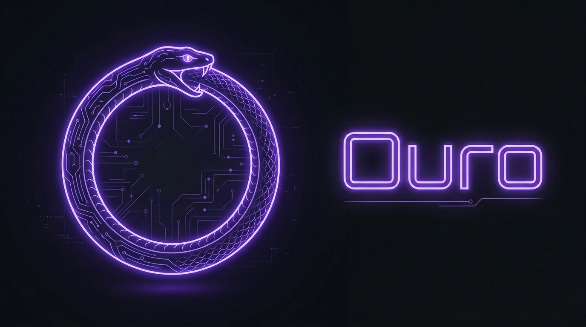
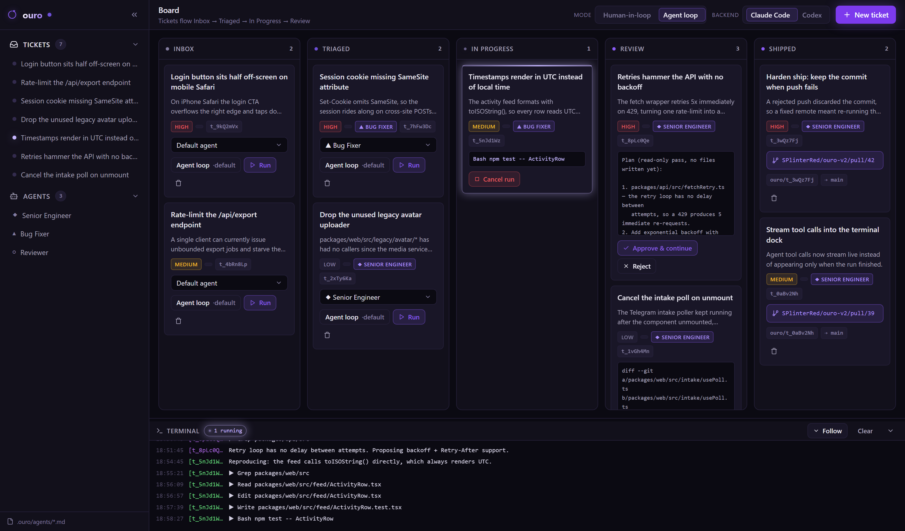
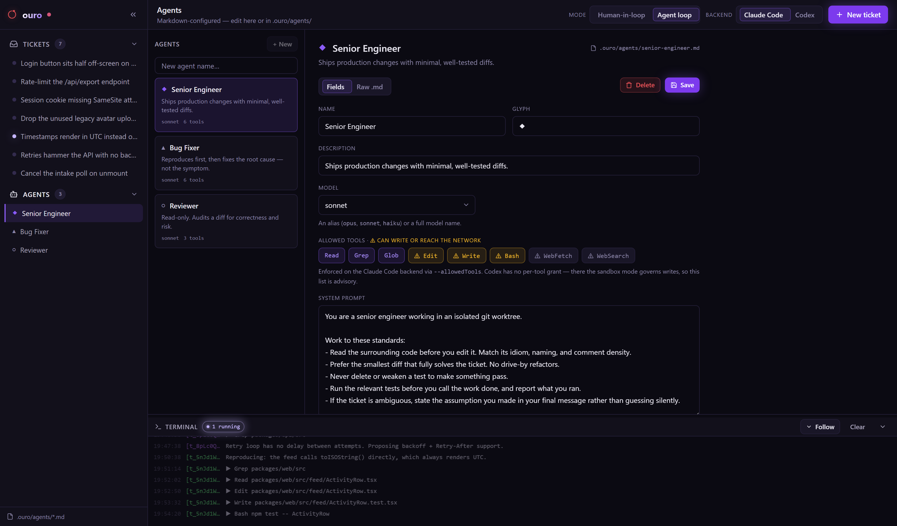

<div align="center">



**Loop engineering for the repo you already have.**

Ouro roots into your repo and gives you a kanban board, coding agents, and an
optional Telegram intake bot. File a ticket, hit Run, get a pull request.
It runs on the **Claude Code** or **Codex** subscription you already pay for —
no API key.

<br>

[](LICENSE)
[](https://nodejs.org)
[](#backends)
[](#requirements)

</div>

---

## Contents

- [Requirements](#requirements)
- [Install](#install)
- [Your first ticket](#your-first-ticket)
- [The board](#the-board)
- [A run ends in a PR](#a-run-ends-in-a-pr)
- [Running it in the background](#running-it-in-the-background)
- [Agents are markdown](#agents-are-markdown)
- [Telegram intake](#telegram-intake)
- [CLI reference](#cli-reference)
- [Configuration](#configuration)
- [Backends](#backends)
- [Before you rely on it](#before-you-rely-on-it)
- [License](#license)

---

## Requirements

- **Node ≥ 20** and **git**
- One of:
  - [`claude`](https://claude.com/claude-code) installed and logged in — the default, or
  - [`codex`](https://developers.openai.com/codex/cli) installed and logged in (`codex login`)
- Optional: [`gh`](https://cli.github.com), authenticated — lets ouro open the PR for you
- Optional: a Telegram bot token from [@BotFather](https://t.me/BotFather) — for intake

No `ANTHROPIC_API_KEY` or `OPENAI_API_KEY`. Ouro drives the CLI you're already
logged into.

## Install

```bash
npm install -g @alexgaledo/ouro
```

That's the whole install — the dashboard ships pre-built inside the package.
The command is `ouro`, regardless of the scoped package name.

Or run it without installing anything:

```bash
npx @alexgaledo/ouro start
```

<details>
<summary>From source</summary>

```bash
git clone https://github.com/AlexGaledo/Ouro-CLI
cd Ouro-CLI

npm install
npm run bundle                      # build the dashboard + copy it into the CLI
npm link --workspace=packages/cli   # makes `ouro` available globally
```

`npm run bundle` is not optional — the CLI serves a pre-built dashboard, so
skipping it leaves you running a stale one (or none at all). Re-run it after
any change under `packages/dashboard`.

</details>

## Your first ticket

**In the repo you want to work on** — not in the ouro repo:

```bash
ouro init        # writes .ouro/config.json + agents/*.md
ouro start       # dashboard + intake agent, detached
```

Open <http://localhost:4747>. Then:

1. **+ New ticket** — give it a title and a summary.
2. Pick an agent on the card (**Senior Engineer**, **Bug Fixer**, or **Reviewer**).
3. Set **Mode** in the header — start with **Human-in-loop**, the default.
4. Hit **Run**. Tool calls stream into the terminal dock as the agent works.
5. It plans first and pauses. Read the plan, click **Approve & continue**.
6. It finishes, commits, pushes, and opens a PR. The card lands in **Shipped**
   with the link on it.

`ouro stop` when you're done.

## The board

Tickets flow **Inbox → Triaged → In Progress → Review → Shipped**, and can be
cancelled at any point. Cancelling kills the running agent process — it doesn't
just flip a label.



The one bright, pulsing thing on the board is a live agent run, so a glance
tells you whether anything is actually happening.

Each ticket runs in one of two modes, set board-wide from the header and
overridable per card:

| Mode | Behaviour |
| --- | --- |
| **Human-in-loop** | Plans read-only first and waits. Nothing is written until you hit **Approve**. |
| **Agent loop** | Full autonomy — the agent writes without pausing. |

Every run happens in its own `git worktree` under `.ouro/worktrees/`, on a
throwaway `ouro/<ticket-id>` branch. **Your working branch is never touched.**

## A run ends in a PR

When a run finishes with changes, ouro commits them on `ouro/<ticket-id>`,
pushes, and opens a PR with `gh`.

If any of that can't happen, **your work is still kept**:

| What's missing | What happens |
| --- | --- |
| No git remote | Commits locally, stays in Review, tells you why |
| Push rejected | Commit kept, stays in Review with git's message |
| `gh` not installed | Branch pushed, you open the PR yourself |
| Agent changed nothing | No PR — marked done, nothing to review |

Failed ships stay in Review with a **Retry PR** button, so fixing a remote or
running `gh auth login` doesn't mean re-running the agent.

Don't want automatic pushing? Set `"autoShip": false` in `.ouro/config.json` and
you get an explicit **Create PR** button instead.

## Running it in the background

```bash
ouro start      # dashboard + intake, detached — survives closing the terminal
ouro status     # what's up, for how long, on which port
ouro logs -f    # follow both services
ouro stop       # stops both, and kills any agent runs they own
ouro restart
```

Logs live in `.ouro/logs/`, rotating at 5MB.

`.ouro/` keeps runtime state (`run/`, `logs/`, `worktrees/`, `.env`,
`tickets.json`) out of git for you, while leaving `agents/*.md` and
`config.json` tracked so your agent config is reviewable like any other file.

## Agents are markdown

Agents live in `.ouro/agents/*.md` — YAML frontmatter plus a body that becomes
the system prompt. Edit them in the dashboard (structured fields or raw `.md`)
or in your editor; the dashboard reloads either way.



```markdown
---
name: Senior Engineer
glyph: ◆
description: Ships production changes with minimal, well-tested diffs.
model: sonnet
tools: [Read, Grep, Glob, Edit, Write, Bash]
---

You are a senior engineer working in an isolated git worktree.
Prefer the smallest diff that fully solves the ticket. Never delete a test...
```

`ouro init` seeds three: **Senior Engineer**, **Bug Fixer**, **Reviewer**.
Assign one per ticket from the card or the new-ticket form.

`model` takes an alias (`opus`, `sonnet`, `haiku`) or a full model name.

**`tools` is enforced on the Claude Code backend** via `--allowedTools`. On
Codex it's advisory — Codex has no per-tool grant model, so its sandbox governs
writes instead. While an agent is planning, its grants are intersected with
read-only tools, so an agent that can `Write` still can't write before you
approve.

## Telegram intake

Optional. `ouro listen` runs a bot that interviews whoever reports a problem —
observed behaviour, expected, repro, impact — drafts a ticket, shows it to them,
and only posts to the board once they confirm.

```
them: the login button is broken
bot:  What happens when you click it — nothing, an error, or does it spin?
them: on mobile safari it sits half off the right edge, tapping does nothing
bot:  Just the login screen, or other pages too? Does desktop look right?
them: only safari on iphone. chrome desktop is fine.
bot:  Here's what I've got: [drafted ticket] — Create this ticket? (yes / no)
```

It asks at most 4 questions, then drafts from whatever it has. `/new` restarts,
`/cancel` drops it.

To enable it, put the token in `.ouro/.env` **before** `ouro start`:

```bash
echo 'OURO_TELEGRAM_BOT_TOKEN=<token>' >> .ouro/.env
```

> Secrets go in `.ouro/.env` (gitignored), **not** your shell profile — the
> background daemon can't read exports from a terminal you've closed.

## CLI reference

| Command | What it does |
| --- | --- |
| `ouro init [--backend claude-code\|codex]` | Configure the current repo — writes `.ouro/config.json`, seeds `agents/*.md` |
| `ouro start [-p <port>] [--no-listen]` | Start dashboard + intake in the background |
| `ouro stop` | Stop both, and kill any agent runs they own |
| `ouro restart [-p <port>] [--no-listen]` | Stop, then start |
| `ouro status` | What's running, for how long, on which port |
| `ouro logs [dashboard\|listen] [-f] [-n <n>]` | Show/follow background service logs |
| `ouro dashboard [-p <port>] [--no-open]` | Run the dashboard in the foreground |
| `ouro listen` | Run the Telegram intake agent in the foreground |

Default port is **4747**. The foreground commands are what you want when a
background service won't stay up and you need to see why.

## Configuration

`.ouro/config.json` is meant to be hand-edited. Writes merge rather than
replace, so a key you add by hand survives a toggle in the dashboard.

```jsonc
{
  "version": 1,
  // "claude-code" | "codex" — also switchable live from the dashboard header
  "backend": "claude-code",
  // "human" = plan, wait for Approve, then write. "agent" = full autonomy.
  "defaultMode": "human",
  // Commit + push + open a PR automatically when a run finishes with changes.
  // false gives you an explicit "Create PR" button instead.
  "autoShip": true,
  "telegram": {
    "botTokenEnvVar": "OURO_TELEGRAM_BOT_TOKEN",
    "chatIdEnvVar": "OURO_TELEGRAM_CHAT_ID"
  }
}
```

Switching backend from the dashboard header rewrites this file and takes effect
on the next run — no restart needed.

Secrets, in `.ouro/.env`:

| Variable | Purpose |
| --- | --- |
| `OURO_TELEGRAM_BOT_TOKEN` | Bot token from [@BotFather](https://t.me/BotFather). Required for `ouro listen`. |
| `OURO_TELEGRAM_CHAT_ID` | Optional. Restricts intake to a single chat. |

## Backends

Ouro talks to two CLIs rather than one API, so it isn't tied to one vendor.
Switch anytime from the dashboard header.

| Backend | Needs | Status |
| --- | --- | --- |
| **Claude Code** (default) | `claude` installed + logged in | Verified against live runs |
| **Codex** | `codex` installed + `codex login` | **Not yet verified against a live run** — try it before you depend on it |

## Before you rely on it

- **There is no authentication.** Ouro is single-operator and local-only by
  design. Don't expose the port to a network you don't trust.
- **Agents run with real tools in a real worktree.** Isolation is per-ticket via
  `git worktree`, not a container. Start in **Human-in-loop** until you trust an
  agent's plans.
- **The Codex backend hasn't been verified against a live run.** Claude Code
  has.
- **Opening a PR against a real GitHub remote hasn't been verified end-to-end
  yet.** Commit, push, and every failure path have been — and every failure
  keeps your commit — but the first real PR is the one that proves it.
- **Human-in-loop is plan → approve → execute**, not a live mid-run pause. Both
  CLIs run headless, so an unapproved action fails rather than blocking.
- **`.ouro/worktrees/` isn't pruned automatically.** Shipping pushes the branch
  but leaves the local checkout. Clean up with `git worktree remove` when it
  gets noisy.
- **A ticket left mid-run by a stopped dashboard is marked cancelled** on the
  next start — its process is gone and can't be reattached. Re-run it.

## License

[MIT](LICENSE) © 2026 Alex Galedo
